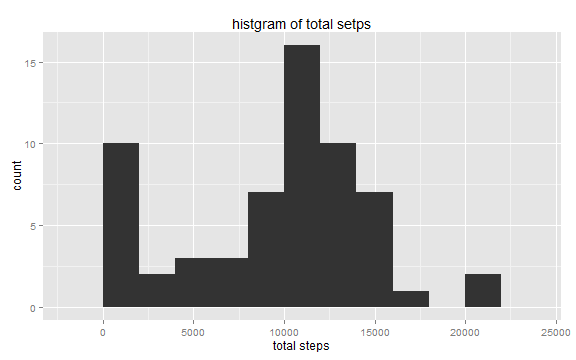
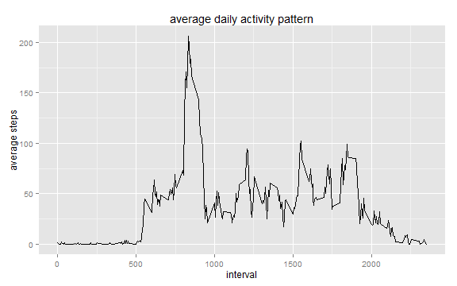
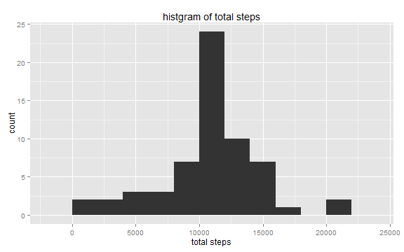
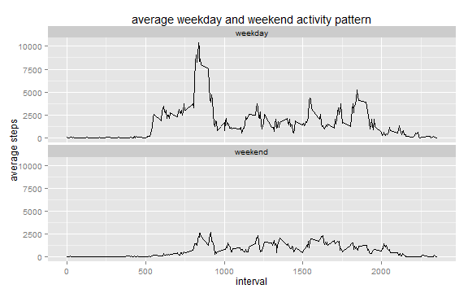

# Reproducible Research: Peer Assessment 1


```r
library(knitr)
opts_chunk$set(echo = TRUE, tidy=FALSE, fig.width = 8, fig.height=5)
```


## Loading and preprocessing the data

```r
rm(list = ls()) ##clear the environment

activity = read.csv("./activity.csv", header=T, 
                    colClasses = c("numeric", "Date", "numeric"))
```


## What is mean total number of steps taken per day?

```r
library(dplyr)
#library(xtable)

steps_per_day = activity %>%
            group_by(date) %>%
            summarise( total_steps = sum(steps, na.rm=T))
paste("steps mean is ", round( mean(steps_per_day$total_steps), 1), 
      " and steps median is ", median(steps_per_day$total_steps) )
```

```
## [1] "steps mean is  9354.2  and steps median is  10395"
```


```r
library(ggplot2)
p = ggplot(steps_per_day, aes(x=total_steps))
p + geom_histogram(aes(y = ..count..), binwidth=2000)+
    ggtitle("histgram of total setps") + 
    xlab("total steps")
```

 


## What is the average daily activity pattern?


```r

daily_pattern = activity %>%
    filter(! is.na(steps) ) %>%
    group_by(interval) %>%
    summarise(mean_steps = mean(steps) )


p = ggplot(daily_pattern, aes(interval, mean_steps))
p + geom_line() + 
    ggtitle("average daily activity pattern")+
    ylab("average steps")
```

 


To get interval of the maximum number of steps, we can sort the **mean_steps** of daily pattern data Descendingly.


```r
max_step = daily_pattern %>%
            arrange(desc(mean_steps), interval) %>%
            head(1)
max_step
```

```
## Source: local data frame [1 x 2]
## 
##   interval mean_steps
## 1      835      206.2
```


So, the interval is 835
## Imputing missing values
To get the total number of 'NA', the easieast way is 

```r
sum(is.na(activity$steps))
```

```
## [1] 2304
```


Filling the missing data.

```r
library(data.table)
activity = as.data.table(activity)
#filling the missing steps using the mean of steps for that interval
filling_missing_data = activity[, steps:=ifelse(is.na(.SD$steps), 
                                               mean(.SD$steps, na.rm=T), 
                                               .SD$steps), 
                                interval]
```


```r
steps_per_day_nomissing = filling_missing_data %>%
    group_by(date) %>%
    summarise(total_steps  = sum(steps))

p = ggplot(steps_per_day_nomissing, aes(x=total_steps))
p+geom_histogram(aes(y=..count..), binwidth = 2000) + 
    ggtitle("histgram of total steps") + 
    xlab("total steps")
```

 

```r

paste("steps mean is ", round( mean(steps_per_day_nomissing$total_steps), 1), 
      " and steps median is ", round( median(steps_per_day_nomissing$total_steps) ))
```

```
## [1] "steps mean is  10766.2  and steps median is  10766"
```

```r

```


## Are there differences in activity patterns between weekdays and weekends?


```r
# set the locale
Sys.setlocale("LC_TIME", "C")
```

```
## [1] "C"
```

```r

#generate weekdays and its type (e.g. weekday or weekend)
wkdays = weekdays(filling_missing_data$date, abbreviate=T)
type = ifelse(wkdays %in% c("Sat", "Sun"), "weekend", "weekday" )

weektype = filling_missing_data %>% 
    mutate(type = factor(type) ) %>%
    group_by(interval, type) %>%
    summarise(total_steps = sum(steps))

p = ggplot(weektype, aes(interval, total_steps))
p + geom_line() + facet_wrap(~type, ncol=1) + 
    ggtitle("average weekday and weekend activity pattern") + 
    ylab("average steps")
```

 

